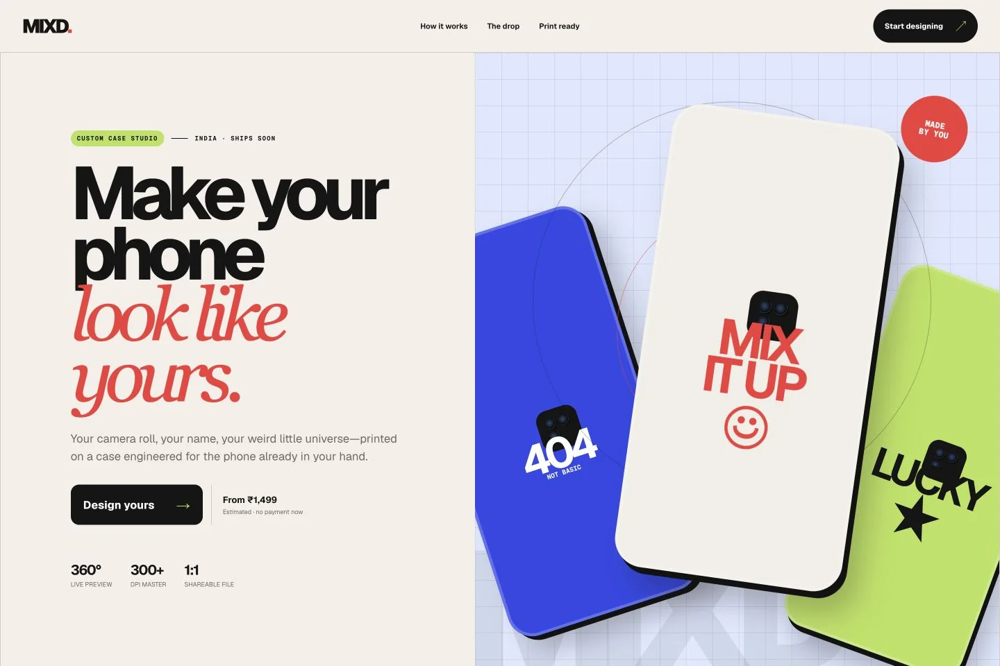
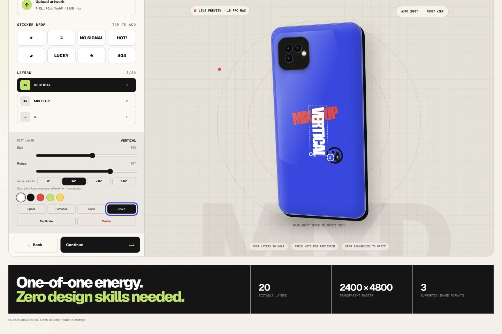

# MIXD. Case Studio

MIXD. is an open-source, print-ready phone-case customizer. A customer chooses a supported device and case finish, positions text, stickers, or uploaded images at any angle, previews the case in 3D, and creates an unlisted link containing the exact saved design.

The studio shows an Indian-rupee estimate only. It has no checkout and no account system.

## Product preview

<p align="center">
  
</p>

<p align="center"><sub>Product homepage · responsive case concepts · INR pricing</sub></p>

<p align="center">
  
</p>

<p align="center"><sub>Live Studio · free positioning and rotation · 2400 × 4800 transparent print master</sub></p>

## What is included

- Responsive product homepage and touch-friendly design studio
- Data-driven iPhone and Pixel catalogue that can be extended without changing UI components
- Free positioning and rotation for text, stickers, and images
- Mouse, touch, keyboard, angle presets, and full-case orbit controls
- Deterministic transparent PNG output at 2400 × 4800 pixels
- Device-specific physical dimensions and print metadata
- Unlisted, replayable design links backed by Cloudflare D1 and R2
- Upload validation, same-origin mutation checks, request limits, idempotent saves, and production security headers
- Browser-only phone input; new phone numbers are never sent to or stored by the server

## Quick start

Prerequisites:

- Node.js 22.13 or newer (`.nvmrc` is included)
- npm 10 or newer

From the project root:

```bash
nvm use
npm ci
npm run dev
```

Open [http://localhost:3000](http://localhost:3000). The development command is fixed to port 3000 and uses local Cloudflare D1/R2 emulation; no cloud account or environment file is required.

Run the complete verification suite before opening a pull request:

```bash
npm run check
```

## Commands

| Command | Purpose |
| --- | --- |
| `npm run dev` | Start the local site on port 3000 |
| `npm run typecheck` | Type-check without emitting files |
| `npm run lint` | Run ESLint |
| `npm test` | Run deterministic unit and contract tests |
| `npm run build` | Produce the Cloudflare Worker bundle in `dist/` |
| `npm run check` | Type-check, lint, test, and build |
| `npm run db:generate` | Generate an additive Drizzle migration after a schema change |

## How the system works

The Next-compatible UI is compiled by vinext and runs in a Cloudflare Worker. D1 stores validated design metadata; R2 stores original uploaded artwork and final print PNGs. Shared pages load their immutable design specification from D1 and source artwork through a same-origin API.

```text
Browser studio
  ├─ source images ──> /api/assets ──> R2 + asset record in D1
  ├─ print PNG ──────> /api/assets ──> R2 + asset record in D1
  └─ validated spec ─> /api/designs ─> D1 ──> /d/<unlisted-id>
```

See [Architecture](docs/ARCHITECTURE.md), [Print pipeline](docs/PRINT_PIPELINE.md), and [Privacy](docs/PRIVACY.md) for the contracts and trade-offs.

## Add another phone

Add the brand, if new, to `DEVICE_BRANDS` and add the device geometry to `DEVICES` in `app/studio/catalog.ts`. Every device needs a stable ID, camera style, preview aspect ratio, and physical print width/height in millimetres. The catalogue consistency test fails when a device references an undeclared brand.

Adding a genuinely new camera layout requires extending the `CameraStyle` union and its preview/rendering branches. Do not reuse a visually similar camera style when the print cutout differs.

## Storage and privacy

Creating a share link stores the customer name, design JSON, production reference, and R2 asset keys. The phone field is used only in the current browser to format a WhatsApp share target; the current client does not transmit it, and the server writes `NULL` for compatibility with the existing schema. Shared links are unlisted, not authenticated—anyone with a link can view that design.

Do not put secrets in `.env` files committed to source control. Local runtime state lives under ignored `.wrangler/`.

## Deployment

The checked-in `.openai/hosting.json` declares the required logical bindings:

- D1: `DB`
- R2: `CASE_ASSETS`

Migrations are packaged into the build output. Read [Deployment](docs/DEPLOYMENT.md) before promoting a build. This repository does not include production IDs, credentials, or a committed deployment.

## Contributing and security

Read [CONTRIBUTING.md](CONTRIBUTING.md) before changing public contracts or migrations. Report vulnerabilities using [SECURITY.md](SECURITY.md), not a public issue. Project decisions for coding agents live in [AGENTS.md](AGENTS.md).

Licensed under the [MIT License](LICENSE).
